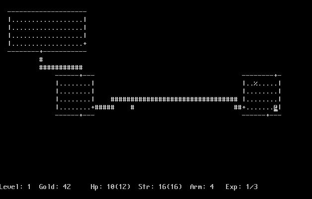

Rogue.JS
========

JavaScript porting of original [Rogue](https://en.wikipedia.org/wiki/Rogue_(video_game)) source code using Emscripten. [Play online! (some bugs)](http://mad4j.github.io/rogue.js/index.html)

# Builds
* [Last stable](https://github.com/mad4j/rogue.js/tree/gh-pages/)
* [Night build](https://github.com/mad4j/rogue.js/tree/master/dist)

# References
* [Rogue5.4](http://rogue.rogueforge.net/rogue-5-4/) original rogue source code
* [Emscripten](https://github.com/kripken/emscripten/wiki) LLVM to JavaScript compiler
* [Curses.JS](https://github.com/mad4j/curses.js) JavaScript port of [PDCurses](https://github.com/wmcbrine/PDCurses) 
* [Misc](http://coredumpcentral.org/) all you need on Rogue

# See also
* https://github.com/donnierussellii/donnierussellii.github.io

